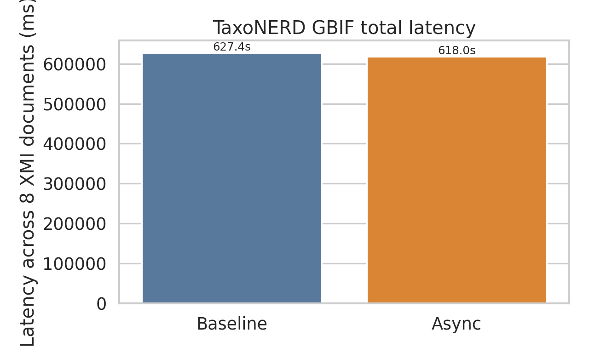
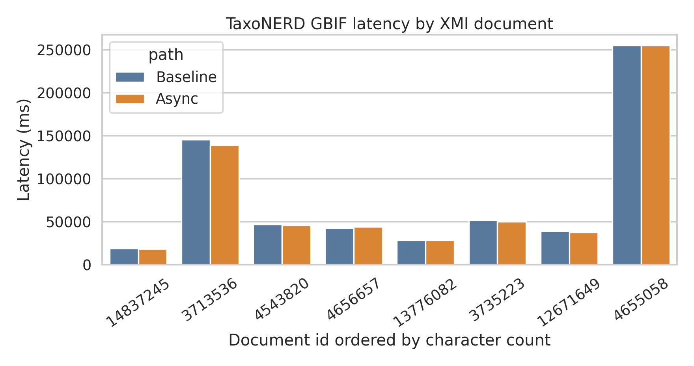
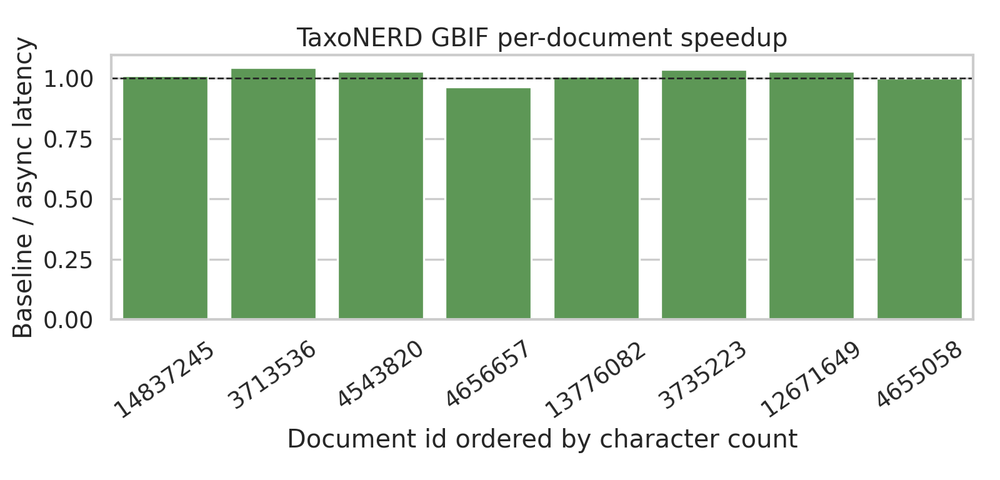
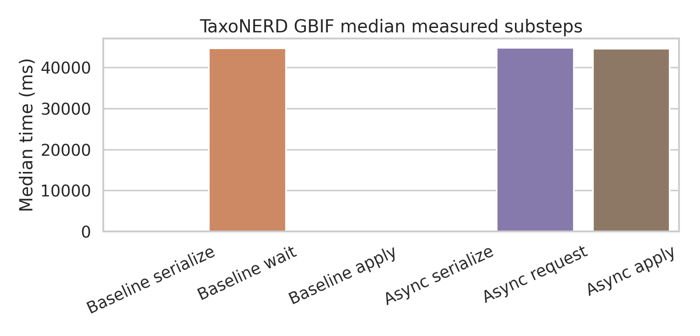
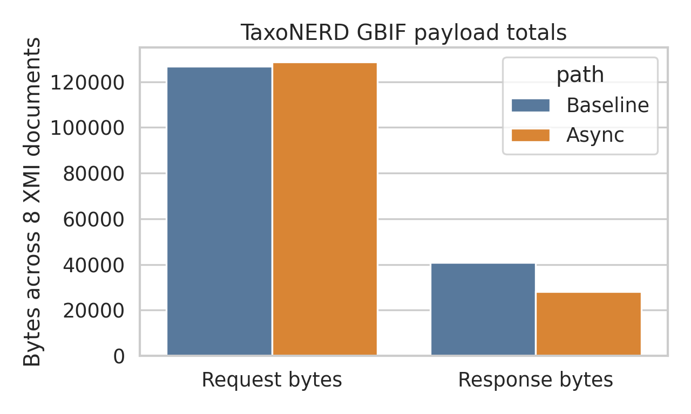

# DUUI-Py Evaluation: Corrected TaxoNERD GBIF Transport Result

Master's computer science research project presentation, May 2026.

This report records the corrected TaxoNERD GBIF baseline-versus-async evaluation after removing a hidden package-path and preload asymmetry from the previous result. The terminology is restricted to **baseline** and **async variant**. The baseline is the buffered HTTP POST path with `streamingTransport(false)`. The async variant is the streaming path with `streamingTransport(true)` and the generated MsgPack/Lua codec and adapter.

The earlier TaxoNERD claim of a large speedup is rejected. It compared a legacy container using the installed `abrami/taxonerd` package against an async container whose `PYTHONPATH` selected a vendored TaxoNERD package and whose runtime could preload model/linker state before the measured process request. The corrected async image uses `PYTHONPATH=/app/src` and `TAXONERD_PRELOAD=false`.

## Evaluation Method

The corrected run uses the DUUI rework runtime and XMI documents only. The relevant test is `DUUILegacyModernAnnotatorMatrixTest#compareTaxonerdLegacyJsonLuaAndModernGeneratedMsgpackLuaOnXmi`. Each measured row executes the same XMI document once through the baseline endpoint and once through the async endpoint. Both paths use `model=en_ner_eco_md`, `linking=gbif_backbone`, `input_strategy=legacy-procedure`, and `linker_strategy=ann-original`.

Both TaxoNERD containers were freshly restarted before the accepted run. The existing symmetric warmup switch was enabled before measurement so that the result measures steady-state `/v1/process` behavior rather than first-request model/linker initialization. The accepted raw matrix contains eight XMI documents between 5,410 and 22,461 characters.

Every reported numeric metric is read through `metricRequired(...)`; a missing metric fails the test instead of producing an empty result cell. The corrected run completed with one JUnit test executed, zero failures, zero errors, and exit code zero.

## Integrity Checks

The comparison path is the rework runtime, not the legacy orchestration path. The test constructs a `DUUI.system(...).pipeline(...)` pipeline, emits a single `JCas`, and creates one remote v1 component per request. The baseline request calls `component.streamingTransport(false)` and uses the legacy JSON Lua communication path. The async request calls `component.streamingTransport(true)` and uses the endpoint-provided generated MsgPack/Lua communication layer.

Process payload conversion is still performed through Lua. Java orchestrates the request, HTTP body handling, event capture, and Lua invocation; it does not decode the TaxoNERD payload as a separate Java-side protocol.

Correctness is checked at target taxon-count level in this matrix. All eight corrected rows have `output_equal=true`, with matching baseline and async target taxon counts.

## Corrected Result

| metric | corrected value |
|---|---:|
| XMI documents | 8 |
| character range | 5,410-22,461 |
| baseline total latency | 627,396 ms |
| async total latency | 617,952 ms |
| total speedup | 1.015x |
| median per-document speedup | 1.021x |
| baseline median latency | 44,778.0 ms |
| async median latency | 44,923.5 ms |
| baseline p95 latency | 216,349.2 ms |
| async p95 latency | 214,137.6 ms |
| baseline request bytes | 126,776 |
| async request bytes | 128,713 |
| baseline response bytes | 40,832 |
| async response bytes | 28,169 |
| rows with matching taxon counts | 8/8 |
| missing numeric metrics | 0 |

The corrected TaxoNERD result is therefore not a large transport speedup. The async response payload is smaller, but total latency is dominated by TaxoNERD entity recognition and GBIF linking. Under the corrected steady-state setup, the async path is only 1.015x faster in aggregate.

## Figures

<figure>
  
  <figcaption style="font-size:0.92em; margin-top:0.6em;"><strong>Figure 1.</strong> Corrected total latency across the eight XMI documents. The aggregate difference is small after removing package-path and preload asymmetry.</figcaption>
</figure>

<figure>
  
  <figcaption style="font-size:0.92em; margin-top:0.6em;"><strong>Figure 2.</strong> Corrected per-document TaxoNERD latency. The largest document dominates both paths, and async does not change the main annotator/linker cost.</figcaption>
</figure>

<figure>
  
  <figcaption style="font-size:0.92em; margin-top:0.6em;"><strong>Figure 3.</strong> Corrected per-document speedup. Values cluster around 1.0x, which is the expected pattern when transport is not the bottleneck.</figcaption>
</figure>

<figure>
  
  <figcaption style="font-size:0.92em; margin-top:0.6em;"><strong>Figure 4.</strong> Median measured substeps. The large values are request-duration measurements covering the annotator/linker execution interval; serialization and response application are small in comparison for the buffered path.</figcaption>
</figure>

<figure>
  
  <figcaption style="font-size:0.92em; margin-top:0.6em;"><strong>Figure 5.</strong> Corrected request and response byte totals. The async response is smaller, but the request size is nearly identical and payload reduction is not enough to dominate total latency.</figcaption>
</figure>

## Interpretation

The corrected TaxoNERD GBIF evaluation shows that transport optimization alone is not the decisive factor for this annotator in the tested configuration. The expensive operations are the TaxoNERD model execution and GBIF linking path. The async transport still produces smaller responses and preserves output count equivalence, but it does not materially reduce the end-to-end process request because the annotator procedure dominates.

This result changes the research conclusion for TaxoNERD. The previous large speedup was caused by an invalid comparison of different runtime states and package paths. The defensible conclusion is narrower: the generated async codec/adapter is approximately cost-neutral for TaxoNERD GBIF under steady-state conditions, while the main optimization target must be the entity-recognition and linking implementation rather than the wire path.

## Provenance

| artifact | path |
|---|---|
| corrected raw matrix | `reports/latest-evaluation-20260527-122624/exact-baseline-vs-async-rework-only/matrix.tsv` |
| corrected row CSV | `reports/latest-evaluation-20260527-122624/current_numeric_rows.csv` |
| corrected summary CSV | `reports/latest-evaluation-20260527-122624/current_summary.csv` |
| corrected summary Markdown | `reports/latest-evaluation-20260527-122624/current_summary.md` |
| reproducible TaxoNERD runner | `reports/latest-evaluation-20260527-122624/exact-baseline-vs-async-rework-only/run_taxonerd_fair_warm.sh` |
| test implementation | `DockerUnifiedUIMAInterface/src/test/java/org/texttechnologylab/duui/rework/DUUILegacyModernAnnotatorMatrixTest.java` |

## References

- MessagePack. <https://msgpack.org/>
- OpenTelemetry Logs Data Model. <https://opentelemetry.io/docs/specs/otel/logs/data-model/>
- OpenTelemetry Metrics Data Model. <https://opentelemetry.io/docs/specs/otel/metrics/data-model/>
- Oracle Java SE 21 API, `HttpRequest.BodyPublishers` and `HttpResponse.BodySubscribers`. <https://docs.oracle.com/en/java/javase/21/docs/api/java.net.http/java/net/http/HttpRequest.BodyPublishers.html>, <https://docs.oracle.com/en/java/javase/21/docs/api/java.net.http/java/net/http/HttpResponse.BodySubscribers.html>
